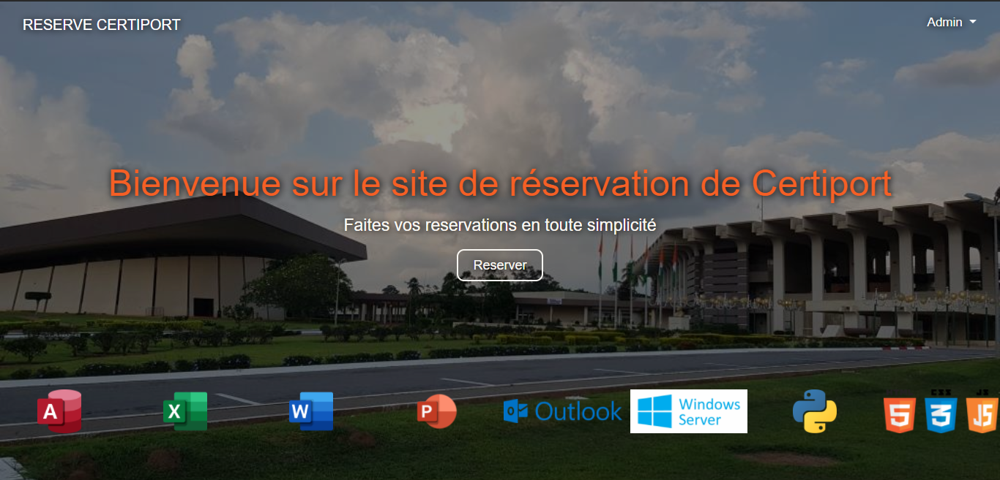
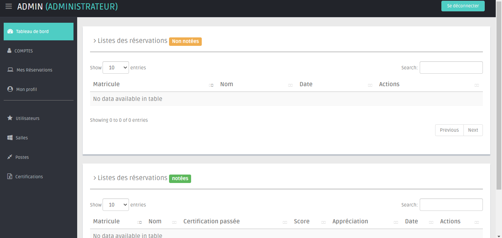

# CERTIPORT-STAGE-INP-2E-ANNEE





Mon projet de stage de deuxième année

## Comment lancer le projet ?

1-Créer une base de données dans mysql nommée `mydb`

2-Importer le fichier `commands/mydb.sql` dans votre logiciel de base de données (phpmyadmin, mysql, laragon) et exécuter la requête

3- Modifier le fichier `views/dashboard/config/config.php` et modifiez le code pour correspondre à votre base de données :

```php
<?php

// configuration de la BD
return array(
    "db_name" => "mydb",
    "db_user" => "utilisateur",
    "db_password" => "mot_de_passe",
    "db_host" => "localhost",
);
```

4- Installer les données de test en lançant la commande : 

```bash
php commands/fill.php
```

5-Lancer le site

```bash
php -S localhost:8000
```

6- Vous pouvez vous connecter au site à l'adresse http://localhost:8000/views/connectivity/login.php avec les identifiants : 

- Matricule : `17INP0001`
- Mot de passe : `admin`
